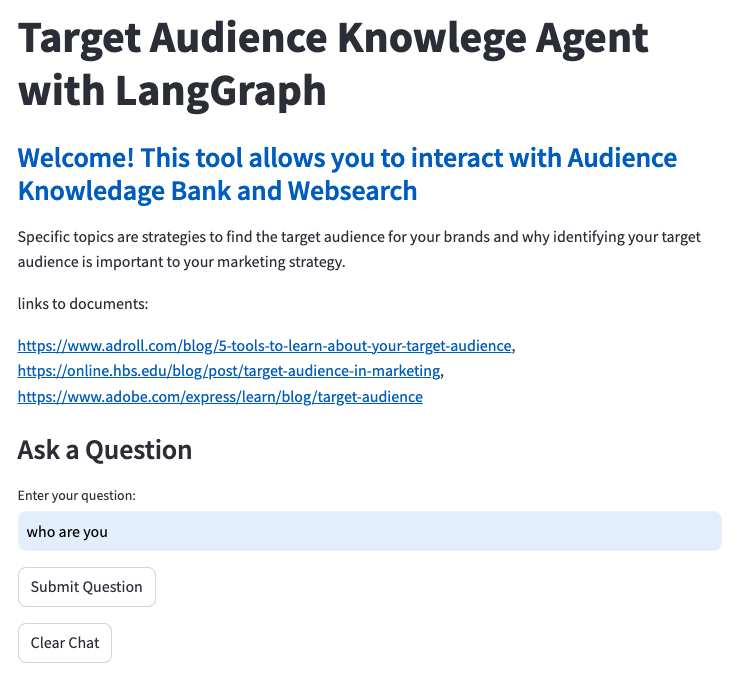
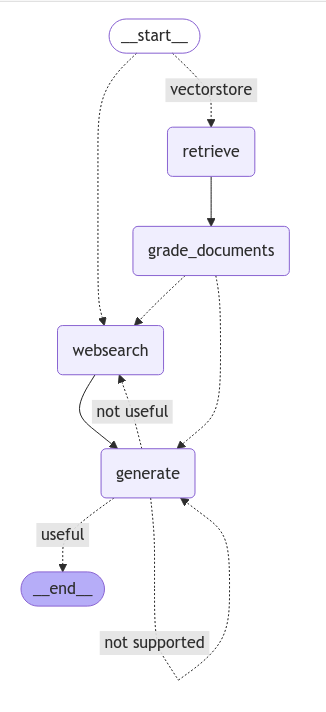

## Target Audience Knowlege Agent with LangGraph

Welcome! This tool allows you to interact with Audience Knowledage Bank and Websearch
You can chat with the agent to get strategies to find the target audience for your brands and why identifying your target audience is important to your marketing strategy.
If the information are not avaliable in the current knowledge bank, the agent will search for it online. 

## Snapshot of the App 

### main interface: 

## Tools
Backend: Flask, LangGraph, Llama 3, Chroma 

Frontend: Streamlit

Agent Flowchat:

